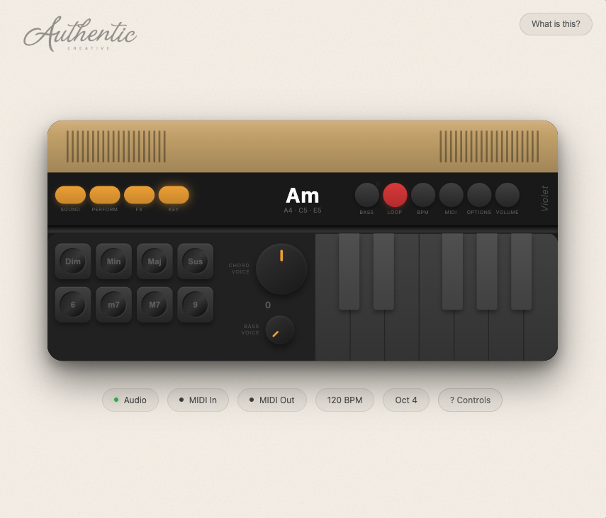

# Violet

A web-based chord synthesizer inspired by the [Telepathic Instruments Orchid](https://telepathicinstruments.com/).

## What is this?

Violet is a browser-based chord generator that lets you play rich, expressive chords with a single key press. Hold modifier keys to change chord types and extensions, adjust voicings, and layer bass notes—all without any music theory knowledge required.

This project is a tribute to the incredible Orchid hardware synthesizer. I couldn't get my hands on one (sold out!), so I built this as a way to explore the concept while waiting for the next batch.

## Features

- **One-finger chords** — Press a single key to play full chords
- **Chord types** — Diminished, Minor, Major, Suspended (hold 1-4)
- **Extensions** — 6th, m7, M7, 9th (hold 5-8)
- **Chord voicing** — Cycle through inversions (Z/X keys)
- **50+ synth presets** — Keys, organs, pads, leads, bass, and atmospheres
- **Bass modes** — Unison, single, or solo bass notes
- **12 bass voices** — Sub, round, warm, pluck, growl, and more
- **Effects** — Reverb, tape delay, chorus, drive
- **Drum machine** — 20 patterns (rock, funk, hip-hop, jazz, etc.)
- **MIDI support** — Input from controllers, output to DAWs/hardware
- **Responsive** — Works on desktop and mobile (landscape)

## Keyboard Controls

### Play Notes
- **A S D F G H J** — White keys (C D E F G A B)
- **W E T Y U** — Black keys (C# D# F# G# A#)

### Chord Modifiers (hold)
- **1** — Diminished
- **2** — Minor  
- **3** — Major
- **4** — Suspended

### Extensions (hold)
- **5** — 6th
- **6** — Minor 7th
- **7** — Major 7th
- **8** — 9th

### Other Controls
- **Z / X** — Voicing down/up (cycles inversions)
- **[ / ]** — Octave down/up
- **- / =** — BPM down/up
- **L** — Toggle drum machine
- **, / .** — Cycle drum patterns
- **Space** — Panic (stop all sound)
- **Esc** — Close menus

## How Voicing Works

The voicing knob (Z/X keys) rearranges the notes in your chord:
- **Turning up (X)** moves the lowest note up an octave
- **Turning down (Z)** moves the highest note down an octave

This creates different inversions of the same chord while keeping its harmonic function.

## Getting Started

1. Open `index.html` in a modern browser
2. Click "Click to Start" to initialize audio
3. Hold a chord type (1-4) and press a note key to play chords
4. Experiment with extensions, voicings, and sounds!

## Tech Stack

- Pure HTML/CSS/JavaScript (no build step)
- [Tone.js](https://tonejs.github.io/) for audio synthesis
- Web MIDI API for controller support

## Contributing

Want to make Violet better? Contributions are welcome! 

1. Fork the repository
2. Create a feature branch (`git checkout -b feature/awesome-improvement`)
3. Make your changes
4. Submit a pull request

Whether it's new synth presets, bug fixes, UI improvements, or documentation—all contributions are appreciated.

## Contact

Have questions, ideas, or just want to say hi?

📧 **inspired@getauthentic.com**

## Credits

- **Inspired by:** [Telepathic Instruments Orchid](https://telepathicinstruments.com/)
- **Built by:** [Nate Siggard](https://natesiggard.com)
- **Company:** [Authentic Creative](https://getauthentic.com)

## Disclaimer

This is a fan project built out of admiration for the Orchid. It's not affiliated with or endorsed by Telepathic Instruments. If you love what you see here, please support them by [buying the real thing](https://telepathicinstruments.com/)!

## License

MIT — Do whatever you want with it. Just don't sue me.

